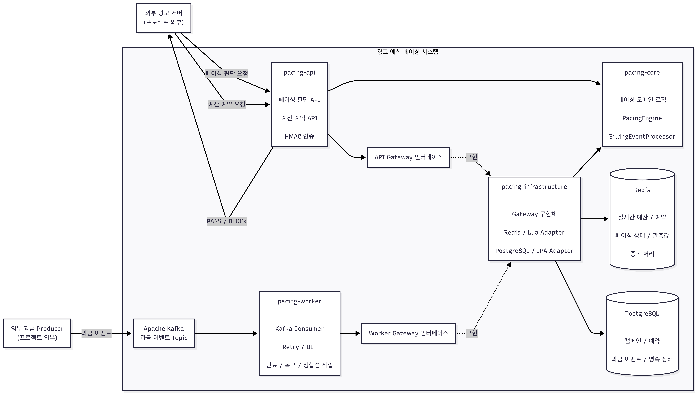

# 광고 예산 페이싱 시스템

광고주가 설정한 예산을 캠페인 기간 동안 적절한 속도로 사용할 수 있도록,  
**예산 소진 상태와 최근 트래픽을 바탕으로 광고 후보의 경매 참여 비율을 실시간으로 조절하는 시스템**입니다.

광고 경매 자체를 구현하는 것이 아니라, 외부 광고 시스템이 전달한 후보에 대해 **경매 참여 여부를 판단**하고,  
낙찰 이후에는 예상 비용을 예약한 뒤 실제 과금 결과를 반영하여 예산의 정합성을 유지하는 역할을 담당합니다.

---

## 주요 기능

- `EVEN`, `PEAK_WEIGHTED`, `ASAP` 전략 기반 실시간 페이싱
- 최근 트래픽을 EWMA로 반영한 경매 참여 비율 동적 조정
- SHA-256 기반 결정적 샘플링을 통한 PASS / BLOCK 판단
- Redis Lua Script 기반 전체·일일 예산 원자적 예약
- Kafka 기반 비동기 과금 처리
- `eventId`, `sequence` 기반 중복·역순 과금 이벤트 처리
- 예약 만료 및 장애 상황에 대한 자동 복구
- 다중 Worker 환경에서의 중복 복구 방지
- HMAC-SHA256 인증, Nonce 재사용 차단 및 Client별 권한 분리
- Prometheus / Grafana 기반 메트릭 수집 및 모니터링

---

## 시스템 구조



---

## 모듈 구성

| 모듈 | 역할 |
|---|---|
| `pacing-core` | 페이싱, 예산, 예약, 과금에 대한 핵심 도메인 규칙 |
| `pacing-api` | HTTP API, 페이싱 판단·예산 예약 orchestration, HMAC 인증, 운영 API |
| `pacing-worker` | Kafka 과금 이벤트 소비, Retry/DLT, 예약 만료·복구·정합성 작업 |
| `pacing-infrastructure` | Redis, Lua Script, PostgreSQL/JPA 기반 Gateway 구현 |

---

# 핵심 처리 흐름

## 1. 최근 트래픽을 반영한 경매 참여 비율 조정

캠페인마다 현재 예산 소진 상태와 최근 트래픽을 이용해  
**다음 요청에서 적용할 경매 참여 비율을 동적으로 계산**합니다.

기본 설정에서는 요청량을 `10초` 단위로 집계하고 최근 완료된 `1분`의 관측값을 사용합니다.

오래된 트래픽과 최근 트래픽을 동일하게 취급하지 않고 **EWMA(Exponentially Weighted Moving Average)** 를 이용해 최근 변화에 더 큰 비중을 둡니다.

광고 판단 요청이 들어왔을 때 마지막 페이싱 비율 갱신 이후 설정된 갱신 주기가 지났다면 최근 관측값을 읽어 새로운 비율을 계산합니다.

### 지원 전략

| 전략 | 동작 |
|---|---|
| `EVEN` | 캠페인 진행 시간에 비례해 예산을 균등하게 소진 |
| `PEAK_WEIGHTED` | 지정된 피크 시간대에 더 많은 예산을 사용할 수 있도록 목표 소진 곡선 조정 |
| `ASAP` | 예산이 존재하는 동안 최대한 빠르게 집행 |

---

## 2. 경매 참여 비율을 개별 요청에 적용

계산된 참여 비율을 실제 광고 후보 요청에 적용하기 위해  
`requestId + campaignId`를 SHA-256으로 해시하여 `0 이상 1 미만`의 샘플 값으로 변환합니다.

```text
sample < pacingRate
        ↓
      PASS

sample >= pacingRate
        ↓
      BLOCK
```

동일한 `requestId + campaignId`는 항상 동일한 샘플 값에 매핑되기 때문에  
**같은 페이싱 비율이 적용되는 동안 난수에 의해 판단 결과가 달라지는 것을 방지**합니다.

---

## 3. 낙찰 후 예상 비용 예약

경매에 참여한 광고가 외부 경매 시스템에서 최종 선택되면 예상 비용을 예약합니다.

예약 시 Redis Lua Script를 이용해 다음 조건을 하나의 원자적 연산으로 확인합니다.

```text
현재 소진액 + 기존 예약액 + 신규 예약액
    ≤ 전체 예산

현재 일일 소진액 + 기존 일일 예약액 + 신규 예약액
    ≤ 일일 예산
```

조건을 만족하면 Redis의 예약액을 증가시키고 예약 상태를 생성한 뒤  
PostgreSQL에 예약 내역을 영속화합니다.

동일한 `reservationId`가 다시 요청된 경우 기존 예약과 캠페인·금액이 동일하면 멱등하게 처리하고,  
다른 값이 사용되면 충돌로 처리합니다.

예약은 기본적으로 `15분`의 TTL을 가지며, 기간 내 과금이 확정되지 않은 예약은 Worker의 만료 처리 대상이 됩니다.

---

## 4. 실제 과금 결과 반영

실제 광고 노출 결과는 Kafka 과금 이벤트로 전달됩니다.

지원하는 이벤트 유형은 다음과 같습니다.

- `CHARGED` : 실제 과금 확정
- `ADJUSTED` : 이미 반영된 과금 금액 조정
- `CANCELLED` : 과금 또는 예약 취소

예를 들어 예상 비용 `1,000`을 예약한 뒤 실제 비용이 `800`으로 확정된 경우:

```text
reservedAmount - 1,000
spentAmount    +   800
```

과 같이 예약액을 제거하고 실제 소진액을 반영합니다.

Redis Lua Script를 이용해 예산 상태와 예약 상태 변경을 원자적으로 처리하고,  
최종 처리 결과는 PostgreSQL에 영속화합니다.

---

## 5. 중복·역순 과금 이벤트 처리

네트워크 재시도나 Worker 장애 상황에서도 동일한 과금이 여러 번 반영되지 않도록  
각 이벤트에 고유한 `eventId`를 사용합니다.

또한 하나의 예약에서 여러 과금 이벤트가 발생할 수 있기 때문에  
예약 단위의 처리 순서를 나타내는 `sequence`를 함께 사용합니다.

```text
현재 처리 sequence = 3

sequence = 4
→ 정상 처리

sequence = 5
→ 선행 이벤트가 처리되지 않았으므로 재시도

sequence <= 3
→ 이미 처리된 순번으로 판단하고 금액 변경 없이 종료
```

Kafka 이벤트는 `reservationId`를 Message Key로 사용하는 계약을 가지며,  
Worker에서도 수신한 Message Key와 `reservationId`가 일치하는지 검증합니다.

---

## 6. 장애 복구 및 다중 Worker 처리

실시간 상태는 Redis에 유지하지만 PostgreSQL에도 예약과 과금 상태를 영속화하여  
장애 발생 시 복구 기준으로 사용합니다.

Worker는 다음 복구 작업을 수행합니다.

### 예약 만료

만료된 예약을 선점할 때 PostgreSQL의

```sql
FOR UPDATE SKIP LOCKED
```

를 사용해 여러 Worker가 동일한 예약을 기다리지 않고 서로 다른 작업을 가져갈 수 있도록 했습니다.

선점 이후에는 Claim Token과 만료 시각을 이용해 처리 소유권을 유지합니다.

### 예약 상태 복구

개별 예약 복구에는 Atomic Claim과 Processing List를 사용합니다.

- 처리 대상 원자적 선점
- 성공 시 제거
- 실패 시 대기열 반환
- Worker 중단 시 일정 시간이 지난 작업 재회수

### 일일 예산 정합성 보정

일일 예산 정합성 보정은 캠페인 단위의 하나의 논리 작업이므로  
Redis Lock을 사용해 여러 Worker 중 하나만 작업을 수행하도록 합니다.

PostgreSQL의 예약·확정 상태 집계 결과와 Redis의 전체·일일 소진액 및 예약액을 비교하고  
차이가 존재하면 Redis 상태를 보정합니다.

---

# API

모든 내부 API는 HMAC 인증이 적용됩니다.

## 페이싱 판단

```http
POST /internal/v1/pacing/decisions/decide
```

```json
{
  "requestId": "decision-001",
  "campaignId": "campaign-001",
  "requestedAt": "2026-08-17T10:00:00Z"
}
```

응답 예시:

```json
{
  "requestId": "decision-001",
  "campaignId": "campaign-001",
  "decision": "PASS",
  "reason": "PASS",
  "pacingRate": 0.42,
  "decidedAt": "2026-08-17T10:00:00Z"
}
```

---

## 예산 예약

```http
POST /internal/v1/budget-reservations
```

```json
{
  "reservationId": "reservation-001",
  "campaignId": "campaign-001",
  "amount": 1000
}
```

신규 예약은 `201 Created`, 동일한 예약의 멱등 재요청은 `200 OK`를 반환합니다.

---

## 캠페인 관리

```http
GET /internal/admin/v1/campaigns/{campaignId}
PUT /internal/admin/v1/campaigns/{campaignId}
```

---

## 피크 정책 관리

```http
GET /internal/admin/v1/peak-policy
PUT /internal/admin/v1/peak-policy
```

---

# 인증 및 요청 보호

API는 `HmacSHA256` 기반 요청 인증을 사용합니다.

필수 헤더:

```text
X-Client-Id
X-Timestamp
X-Nonce
X-Signature
```

서명 대상 Canonical Request:

```text
HTTP_METHOD
REQUEST_PATH
CLIENT_ID
TIMESTAMP
NONCE
SHA256(REQUEST_BODY)
```

Redis를 이용해 Nonce 재사용을 차단하고 Client별 Rate Limit을 적용합니다.

Client 권한은 다음과 같이 분리되어 있습니다.

| Client | 권한 |
|---|---|
| `ad-server` | `PACING_DECIDE`, `BUDGET_RESERVE` |
| `auction-server` | `BUDGET_RESERVE` |
| `operation-server` | `ADMIN` |

---

# 기술 스택

### Backend

- Java 21
- Spring Boot 4.0.7
- Spring MVC
- Spring Security
- Spring Data JPA
- Spring Data Redis

### Data / Messaging

- Redis
- Lua Script
- PostgreSQL
- Apache Kafka
- Flyway

### Test / Monitoring

- JUnit 5
- Testcontainers
- k6
- Prometheus
- Grafana
- Glowroot

### Infra

- Docker
- Docker Compose
- AWS EC2

---

# 로컬 실행

## 사전 요구사항

- Java 21
- Docker Desktop
- Docker Compose
- Windows PowerShell 5.1 이상 또는 PowerShell 7

환경변수 예제를 복사합니다.

```powershell
Copy-Item .env.example .env
```

> `.env.example`의 값은 로컬 테스트용입니다. 실제 운영 Secret으로 사용하지 않습니다.

---

# 성능 및 정합성 검증

## 페이싱 판단 API

`1,000 RPS`를 `30분` 동안 지속하여 총 `1,800,000건`의 요청을 검증했습니다.

| 항목 | 결과 |
|---|---:|
| 요청 수 | 1,800,000 |
| 성공률 | 100% |
| HTTP 실패 | 0 |
| p95 | 1.63 ms |
| p99 | 4.35 ms |

---

## 전체 시스템 부하 테스트

AWS EC2 환경에서 애플리케이션, 데이터 저장소, 부하/모니터링 서버를 분리하여 검증했습니다.

과금 테스트에 사용할 예약 `1,440,000건`을 사전 생성한 뒤,  
1시간 동안 다음 부하를 동시에 발생시켰습니다.

```text
페이싱 판단       1,000 RPS
과금 이벤트       약 400 events/s
```

1시간 동시 부하 구간:

```text
페이싱 판단       3,600,000건
과금 이벤트       1,440,000건
--------------------------------
총 처리           5,040,000건
```

최종 결과:

| 항목 | 결과 |
|---|---:|
| HTTP 실패 | 0 |
| 예약 처리 실패 | 0 |
| Worker 처리 실패 | 0 |
| DLT 이벤트 | 0 |
| 최종 Kafka Consumer Lag | 0 |
| 최종 예약 상태 | 1,440,000건 CONFIRMED |
| PostgreSQL / Redis 소진액 | 14,400,000 |
| 최종 예약액 | 0 |

---

# 주요 성능 개선

## 1. DB Connection Pool 병목

페이싱 판단 요청마다 Redis 캐시 조회까지 DB Transaction 내부에서 수행하면서  
캐시 Hit 상황에서도 DB Connection을 점유하는 문제가 발생했습니다.

Redis 조회를 Transaction 밖으로 분리하여

```text
Redis Hit
→ DB 접근 없이 즉시 반환

Redis Miss
→ PostgreSQL 조회
→ Redis Cache 갱신
```

구조로 변경했습니다.

---

## 2. Cache Stampede

캠페인 캐시 TTL이 만료될 때 동시에 들어온 요청들이 PostgreSQL을 함께 조회하는 문제가 발생했습니다.

Redis 기반 Cache Load Lock을 추가하여 한 요청만 데이터를 갱신하고  
나머지 요청은 갱신 결과를 기다리도록 변경했습니다.

---

## 3. Redis Network Round Trip 감소

페이싱 판단마다 각각 조회하던

- 캠페인
- 전체 예산
- 일일 예산
- 현재 페이싱 상태

를 Lua Script 기반 통합 조회로 변경했습니다.

이를 통해 일반적인 페이싱 판단 경로의 Redis Network Round Trip을 줄였습니다.

---

## 4. 다중 Worker 복구 경쟁

복구 작업을 하나의 Lock 방식으로 처리하지 않고 작업의 성격에 따라 분리했습니다.

```text
일일 예산 정합성 보정
→ Redis Lock

개별 예약 복구
→ Atomic Claim + Processing List

만료 예약
→ FOR UPDATE SKIP LOCKED + Claim Token
```

이를 통해 여러 Worker가 동시에 실행되더라도 중복 작업을 줄이면서  
서로 다른 예약은 병렬로 복구할 수 있도록 했습니다.

---

# 프로젝트 디렉터리

```text
pacing-service
├── pacing-core
│   └── 페이싱 / 예산 / 예약 / 과금 도메인
│
├── pacing-api
│   └── HTTP API / HMAC 인증 / Application Service
│
├── pacing-worker
│   └── Kafka Consumer / Retry / DLT / Recovery Scheduler
│
├── pacing-infrastructure
│   ├── Redis Adapter
│   ├── Lua Script
│   ├── PostgreSQL / JPA Adapter
│   └── Flyway Migration
│
├── scripts
│   └── E2E / 부하 / 장애 / 정합성 검증 스크립트
│
├── docker
│   └── Dockerfile / Prometheus / Grafana 설정
│
└── compose.yml
```

---

# 프로젝트에서 중점적으로 검증한 것

이 프로젝트는 기능 구현만을 목표로 하지 않고 다음 질문을 실제 테스트를 통해 확인하는 것을 목표로 했습니다.

- 트래픽이 갑자기 증가해도 페이싱 비율이 변화에 대응할 수 있는가?
- 동시 요청에서도 예산을 초과해 예약하지 않는가?
- 같은 과금 이벤트가 여러 번 전달되어도 금액이 중복 반영되지 않는가?
- 과금 이벤트가 업무 순서와 다르게 도착해도 최종 상태가 일관되는가?
- 여러 Worker가 동시에 복구 작업을 수행해도 동일한 작업이 중복 처리되지 않는가?
- Redis 상태가 유실되거나 저장소 간 상태가 달라졌을 때 복구할 수 있는가?
- 지속적인 고부하 상황에서도 실패 없이 처리할 수 있는가?